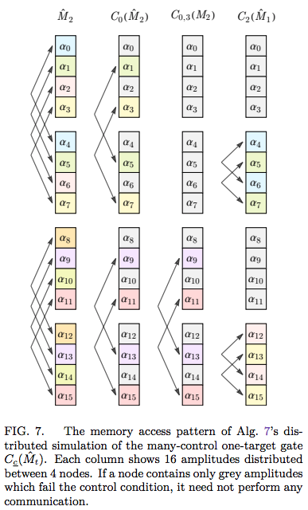

Possible extension to `cuStateVec`
===============

This README motivates some additional `cuStateVec` functions which optimise communication and ergo performance in distributed multi-GPU simulation. These are "bespoke subroutines" which might somewhat complicate the API, because they do not fit into the dichotomy of "perform distributed swaps" and "perform embarrassingly parallel gates". Instead, they involve "perform pairwise communication" and "perform bespoke post-communication operation" steps. They are digestions of [this manuscript](https://arxiv.org/abs/2311.01512), to highlight the specific new GPU kernels needed.


-------------------

## `cuStateVec`'s distribution scheme

Here we explain the limitations with the current distribution method.

`cuStateVec`'s current distribution scheme is to use the "[distributed index bit swap](https://docs.nvidia.com/cuda/cuquantum/23.03.0/custatevec/distributed_index_bit_swap.html)" to swap target qubits into the lower indices so that subsequent modification is embarrassingly parallel, and can leverage `cuStateVec`'s local (i.e. non-distributed) functions.
 One could thereafter invoke the swap _again_ to restore the qubit ordering, or merely re-map the target qubits of subsequent operators. This technique is sometimes called "qubit reordering" or "cache blocking" - see [Sec IV. D](https://arxiv.org/pdf/2311.01512.pdf#page=21).

As a quantum circuit, it resembles
<p align="center">

</p>
where adjacent SWAP gates are merged.

There are a few limitations to this method:

- some gates, like _controlled operators_, do not need _every_ local amplitude to be exchanged to its communicating partner:
  
  <p align="center">
  
  </p>

  We should avoid superfluously communicating the unused amplitudes. We can do this with the `maskBitString` argument to [`custatevecDistIndexBitSwapSchedulerSetIndexBitSwaps`](https://docs.nvidia.com/cuda/cuquantum/23.03.0/custatevec/api/functions.html#custatevecdistindexbitswapschedulersetindexbitswaps), and then perform the local modification (with [`custatevecApplyMatrix`](https://docs.nvidia.com/cuda/cuquantum/23.03.0/custatevec/api/functions.html#general-matrices) specifying `controls`).
  However, we _must_ thereafter perform the "un-swap" after the local modification; we cannot simply update the targets of subsequent operators, due to the control qubits (although I may be confused).
   
   It turns out this _secondary swap_ is _unnecessary_ if we had performed a _different_ local modification step.

- some gates, like Pauli gadgets ([`custatevecApplyPauliRotation`](https://docs.nvidia.com/cuda/cuquantum/23.03.0/custatevec/api/functions.html#custatevecapplypaulirotation)) (and their un-exponentiated form) "move around" the local data in such a way (due to being anti-diagonal) that _pair-wise_ communication is possible. In contrast, the communication pattern admitted by qubit re-ordering may be all-to-all and require more total messages. This is because it is agnostic to the subsequent local modification and does not leverage Pauli (anti-)diagonality.

  For example, consider applying four-qubit gadget $`\exp(i \theta XXXX)`$ upon the highest-index qubits $`\{4,5,6,7\}`$ of an $8$-qubit statevector distributed between $16$ nodes. Using `cuStateVec`'s qubit reordering, our communication pattern resembles:

  <p align="center">
  
  </p>

  where we have divided the communication into pairwise swaps for illustration. The middle $`\hat{M}_{0,1,2,3}`$ operator would be an invocation of `custatevecApplyPauliRotation()`. Of course each SWAP is not individually performed; the amplitudes are moved straight to their destination node by [`custatevecDistIndexBitSwapSchedulerSetIndexBitSwaps`](https://docs.nvidia.com/cuda/cuquantum/23.03.0/custatevec/api/functions.html#custatevecdistindexbitswapschedulersetindexbitswaps). However, the communication remains all-to-all and resembles the left diagram.

  However, using an alternative bespoke subroutine, we can achieve a _pair-wise_ "one-shot" communication pattern:

  <p align="center">
  
  </p>

- sometimes qubit re-ordering _is not possible_ because there are insufficiently many "[local index bits](https://docs.nvidia.com/cuda/cuquantum/23.03.0/custatevec/distributed_index_bit_swap.html)" to swap the "global index bits" into! For example, if we applied the above Pauli gadget upon _every qubit_. There is currently _no way_ to perform distributed simulation of this gate in `cuStateVec`.

  However, the above strategy for simulating Pauli gadgets does _not_ have a size limit. Due to (anti)-diagonality of the Pauli operators, _any_ Pauli gadget is always pair-wise communicating!

  <p align="center">
  
  </p>

-------------------


## alternative distribution scheme

cuStateVec's [`custatevecDistIndexBitSwapSchedulerSetIndexBitSwaps`](https://docs.nvidia.com/cuda/cuquantum/23.03.0/custatevec/api/functions.html#custatevecdistindexbitswapschedulersetindexbitswaps) remains ideal for multi-qubit gates specified as general matrices. But specific operators have exploitable structures which can optimise the communication, and make superfluous the post-communication (or the re-mapping of subsequent operator target qubits). This is explored by [this manuscript](https://arxiv.org/abs/2311.01512).

The essence is that...
- we study each operator by its movement of amplitudes between basis states/indices
- we extract a _pair-wise behaviour_; many operators merely combine pairs of amplitudes
- we extract the necessary _pair-wise communication_; many operators need "pair amplitudes" from only a _single_ other node!
- we perform this bespoke communication (trivial message-pass, but sometimes packing a strided sub-array in a communication buffer)
- we perform a post-communication subroutine which is often specific to the particular simulated operator

The benefits are:

- some gates become possible which are _impossible_ under cuStateVec's current distribution method (e.g. all-qubit gadgets)
- some rounds of communication are made redundant (post-gate "swapping back" is  not necessary, nor is bookkeeping of qubit swaps)
- some communication patterns are simplified (all-to-all becomes pair-wise)
- we can sometimes significantly reduce the amount of communicated data (by packing and sending only specificly needed amplitudes by a gate's bespoke post-comm subroutine)

This repository implements these methods in CPU settings - the communication for inter-GPU is the same (using CUDA-aware MPI for tightly-coupled GPUs). 


-------------------


## necessary bespoke GPU subroutines 


We here summarise the bespoke subroutines of this repository which modify the statevector in ways not currently directly possible with [cuStateVec](https://developer.nvidia.com/cuquantum-sdk). This is because they are subroutines relevant only when using the [manuscript's](https://arxiv.org/pdf/2311.01512.pdf) optimised distributed routines, and are not necessary when using cuStateVec's [distributed bit swap](https://docs.nvidia.com/cuda/cuquantum/23.03.0/custatevec/distributed_index_bit_swap.html) technique.

These subroutines assume that every distributed node (with one MPI process per GPU) has an additional array (I dub the "`buffer`") of size equal to that of its local statevector partition "`amps`". This array is dedicated to receiving amplitudes from other processes, or "packing" a subset of local amplitudes into contiguous memory before sending them. This equal-sized buffer means the _total_ memory costs are _double_ that of non-distributed simulation. This (often) enables to us to require only a _single_ message-pass when simulating distributed operators. It is possible however to shrink this buffer and volunteer _more_ rounds of messaging, overlapping processing and communication, as first demonstrated in [qHipster](https://arxiv.org/abs/1601.07195) - we don't bother making that explicit here.

These code snippets use the self-explanatory types defined further down this README.


### State-vector routines

- **Linearly combine complex-weighted arrays.**

  > Specifically;
  > multiply every local amplitude by `fac0` (a complex scalar), then add the corresponding amplitude in `buffer`, multiplied by `fac1` (another complex scalar).

  ```C++
  for (Index i=0; i<numAmpsPerNode; i++)
      amps[i] = fac0*amps[i] + fac1*buffer[i];
  ```

  This appears as a post-communication subroutine of [**`oneTargetGate`**](https://github.com/TysonRayJones/Distributed-Full-State-Algorithms/blob/fdc33ad7d13f058da8ac5a450c0fcf7f7f6ffa94/src/distributed_statevector.hpp#L18) after every node has received a full buffer from a unique pair node. See [Alg. **6**](https://arxiv.org/pdf/2311.01512.pdf#page=15).


- **Linearly combine a _subset_ of arrays, where one is strided.**
  
  > Specifically:
  > for each element in `buffer` (which contains only `numAmpsToMod` amplitudes), take its index `j` and insert `1` bits at the positions given in (sorted) list `bitIndices`. This gives the 
  > index `k` of the corresponding `amps` amplitude to combine with the `buffer` element (respectively weighted by complex scalars `fac0` and `fac1`).

  ```C++
  NatArray bitIndices = // user-given sorted list; is actually list of control qubits
  Index numAmpsToMod = numAmpsPerNode / pow(2, bitIndices.size());

  for (Index j=0; j<numAmpsToMod; j++) {
      Index k = insertBits(j, bitIndices, 1); // expand j by inserting 1 at every bit index
      amps[k] = fac0*amps[k] + fac1*buffer[j]; // buffer has been pointer-offset (unimportant)
  }
  ```

  This appears as a post-communication subroutine of [**`manyControlledOneTargetGate`**](https://github.com/TysonRayJones/Distributed-Full-State-Algorithms/blob/fdc33ad7d13f058da8ac5a450c0fcf7f7f6ffa94/src/distributed_statevector.hpp#L81). The "sending" nodes packed a fraction `1/2^c` of their local amplitudes into their buffer (where `c` is upperbounded by the number of control qubits),
  then sent this fraction to a unique pair node. The receiving nodes linearly combine this sub-buffer with their local amplitudes, at indices determined by the control qubits. See [Alg. **8**](https://arxiv.org/pdf/2311.01512.pdf#page=18).


- **Linearly combine complex-weighted arrays, with one out-of-order, and multiply one of $`\{\pm i, \pm 1\}`$ onto every amplitude of one array, with sign determined by bit parity.**

  > Specifically:
  > Multiply all elements in `amps` by `fac0`. Multiply all elements in `buffer` by `fac1`.
  > For each element in amps (of index `j0`):
  >   - get index `j1` of its corresponding `buffer` element, by flipping bits as per mask `maskXY`.
  >   - get index `i1` which is the corresponding _global_ amplitude index of `j1`
  >   - get specific bits of `i1` as indicated by bitmask `maskYZ`
  >   - if the number of `1` bits is odd, negate sign of `buffer` elem
  >   - add `buffer` elem (at `j1`) to `amp` elem (at `j0`)

  ```C++
  powI = // i^something, i.e. {1, i, -1, -i}
  maskXY = // bit string (length = log2(numAmpsPerNode))
  maskYZ = // bit string (length = log2(numAmpsPerNode))

  rankShift = rank * numAmpsPerNode // longer bit string where right-most log2(numAmpsPerNode) bits are 0

  for (Index j0=0; j0<numAmpsPerNode; j0++) {

      // get index of corresponding buffer amp
      Index j1 = j0 ^ maskXY;

      // determine b1 = +- i
      Index i1 = rankShift | j1;
      Nat p1 = __builtin_parity(i1 & maskYZ); // 0 if (i1 & maskYZ) has even number of 1 bits, else 1
      int sign = (1 - 2*p1); // +- 1
      Amp b1 = sign * powI; // +-1, +- i

      psi.amps[j0] = fac0*amps[j0] + fac1*b1*buffer[j1];
  }
  ```

  This appears as a post-communication suroutine of [Pauli gadgets and tensors](https://github.com/TysonRayJones/Distributed-Full-State-Algorithms/blob/fdc33ad7d13f058da8ac5a450c0fcf7f7f6ffa94/src/distributed_statevector.hpp#L227) (See [Alg. 11-12](https://arxiv.org/pdf/2311.01512.pdf#page=27) and [Alg. 14](https://arxiv.org/pdf/2311.01512.pdf#page=30)), the former of which are locally implemented in cuStateVec via [`custatevecApplyPauliRotation()`](https://docs.nvidia.com/cuda/cuquantum/latest/custatevec/api/functions.html#id4).


- Routines to pack (or unpack) strided array elements into a contiguous buffer (for message passing).

  > The function which determines _which_ elements to pack into the buffer can be:

  - insert `1` bits into specific locations (as per sorted list `bitIndices`) of buffer index ([example](https://github.com/TysonRayJones/Distributed-Full-State-Algorithms/blob/f29bd6b81156bd315d414cd43f94602be9e00617/src/distributed_statevector.hpp#L57)).
    ```C++
    for (Index j=0; j<numAmpsToPack; j++) {
        Index k = insertBits(j, bitIndices, 1);
        buffer[j] = amps[k];
    }
    ```

  - insert `0` or `1` bit (determined by rank) at specific bit index of buffer index ([example](https://github.com/TysonRayJones/Distributed-Full-State-Algorithms/blob/f29bd6b81156bd315d414cd43f94602be9e00617/src/distributed_statevector.hpp#L170C1-L173C10)).
    ```C++
    bit1 = // 0 or 1, determined by rank
    qb1 = // user-given qubit index

    for (Index k=0; k<numAmpsToPack; k++) {
        Index j = insertBit(k, qb1, bit1);
        buffer[k] = amps[j];
    }
    ```


### Density matrix

[This file](https://github.com/TysonRayJones/Distributed-Full-State-Algorithms/blob/main/src/distributed_densitymatrix.hpp) includes bespoke subroutines necessary to simulate density-matrices by re-leveraging the Choi-Jamiolkowski isomorphism (see [Sec. V A-B](https://arxiv.org/pdf/2311.01512.pdf#page=30)). They may be irrelevant to `cuStateVec` depending on _how_ density matrices are supported.

This is a bit more complicated and will be easiest to understand by reading the manuscript. Happy to chat more about it!


&nbsp;

&nbsp;

&nbsp;

&nbsp;

&nbsp;

&nbsp;

&nbsp;

&nbsp;


--------------------------------------------------------------


[Distributed Simulation of Statevectors and Density Matrices](https://arxiv.org/abs/2311.01512)
===========================================================

> Tyson Jones, Balint Koczor, Simon C. Benjamin  
> - Department of Materials, University of Oxford  
> - Quantum Motion Technologies Ltd


This repository contains `C++` implementations of the multithreaded, distributed algorithms presented in [this manuscript](https://arxiv.org/abs/2311.01512), and unit tests using [Catch2](https://github.com/catchorg/Catch2). If the code is useful to you, feel free to cite
```
@misc{jones2023distributed,
      title={Distributed Simulation of Statevectors and Density Matrices}, 
      author={Tyson Jones and Bálint Koczor and Simon C. Benjamin},
      year={2023},
      eprint={2311.01512},
      archivePrefix={arXiv},
      primaryClass={quant-ph}
}
```

# Types

The below API makes use of the following custom types defined in [`types.hpp`](src/types.hpp), wherein you can vary their precision.

| Type   | Use           | Default
|--------|---------------|----------|
| `Real` | A real scalar | `double` |
| `Nat`  | A natural scalar | `unsigned int` |
| `Index` | A state index | `long long unsigned int` |
| `Amp` | A complex scalar | `std::complex<Real>` |

We also define arrays and matrices of these types, such as `NatArray`, which are merely eye-candy for `std::vector<Nat>`.


# API

Before calling any of the below functions, you should initialise MPI with `comm_init()`, and before exiting, finalise with `comm_end()`.

Instantiate a quantum state via:
```C++
StateVector psi = StateVector(numQubits);
DensityMatrix rho = DensityMatrix(numQubits);
```

Statevectors can be passed to the below unitary functions, prefixed with `distributed_statevector_`.

- ```C++
  oneTargGate(StateVector psi, Nat target, AmpMatrix gate)
  ```
- ```C++
  manyCtrlOneTargGate(StateVector psi, NatArray controls, Nat target, AmpMatrix gate)
  ```
- ```C++
  swapGate(StateVector psi, Nat qb1, Nat qb2)
  ```
- ```C++
  manyTargGate(StateVector psi, NatArray targets, AmpMatrix gate)
  ```
- ```C++
  pauliTensor(StateVector psi, NatArray targets, NatArray paulis)
  ```
- ```C++
  pauliGadget(StateVector psi, NatArray targets, NatArray paulis, Real theta)
  ```
- ```C++
  phaseGadget(StateVector psi, NatArray targets, Real theta)
  ```

Density matrices can be passed to the below functions, prefixed with `distributed_densitymatrix_`.

- ```C++
  manyTargGate(DensityMatrix rho, NatArray targets, AmpMatrix gate)
  ```
- ```C++
  swapGate(DensityMatrix rho, Nat qb1, Nat qb2)
  ```
- ```C++
  pauliTensor(DensityMatrix rho, NatArray targets, NatArray paulis)
  ```
- ```C++
  pauliGadget(DensityMatrix rho, NatArray targets, NatArray paulis, Real theta)
  ```
- ```C++
  phaseGadget(DensityMatrix rho, NatArray targets, Real theta)
  ```
- ```C++
  phaseGadget(DensityMatrix rho, NatArray targets, Real theta)
  ```
- ```C++
  oneQubitDephasing(DensityMatrix rho, Nat qb, Real prob)
  ```
- ```C++
  twoQubitDephasing(DensityMatrix rho, Nat qb1, Nat qb2, Real prob)
  ```
- ```C++
  oneQubitDepolarising(DensityMatrix rho, Nat qb, Real prob)
  ```
- ```C++
  twoQubitDepolarising(DensityMatrix rho, Nat qb1, Nat qb2, Real prob)
  ```
- ```C++
  damping(DensityMatrix rho, Nat qb, Real prob)
  ```
- ```C++
  expecPauliString(DensityMatrix rho, RealArray coeffs, NatArray allPaulis)
  ```
- ```C++
  partialTrace(DensityMatrix inRho, NatArray targets)
  ```

View the definition of these functions in the [`src`](/src/) folder.

See an example in [`main.cpp`](main.cpp).


# Compiling

To compile both [`main.cpp`](main.cpp) and the [unit tests](/tests/), simply call
```bash
source ./compile
```
Additionally, set the number of threads (per node) via
```bash
export OMP_NUM_THREADS=24
```
and launch the executables between (e.g.) `16` nodes via
```bash
mpirun -np 16 ./main
```
```bash
mpirun -np 16 ./test
```
You must use a power-of-2 number of nodes.


# License

This repository is licensed under the terms of the MIT license.